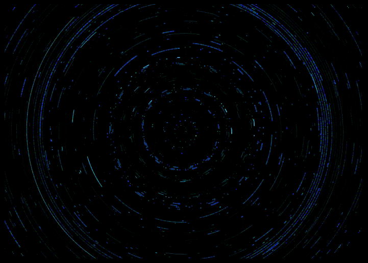
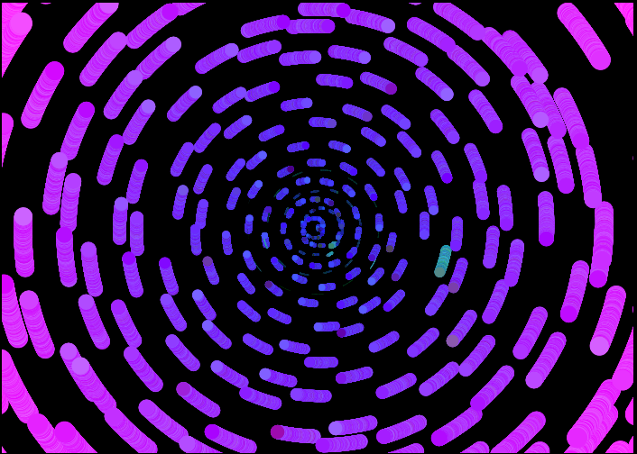
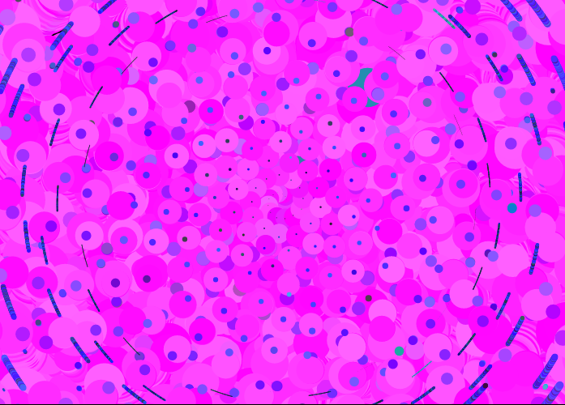

# sequences

Generative art with [Leipzig](https://github.com/ctford/leipzig), [Quil](http://quil.info/), and infinite sequences. 

## Check it out
```
boot dev
```

## So, what is this?

Intended to be a series of visualizations. Right now it only contains an interactive visualization for [Per Nørgård's "infinity sequence"](http://oeis.org/A004718).  

  

## Some examples 

  
  

## TODO
* Refactor to use https://github.com/ctford/cljs-bach
* Add more visualizations, obviously

